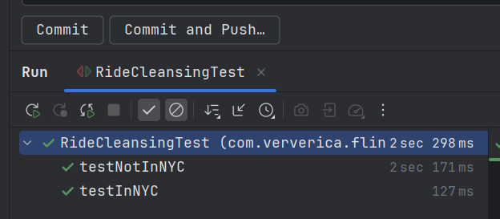
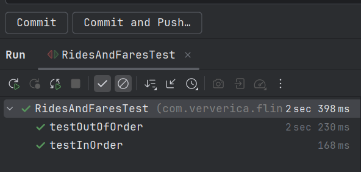
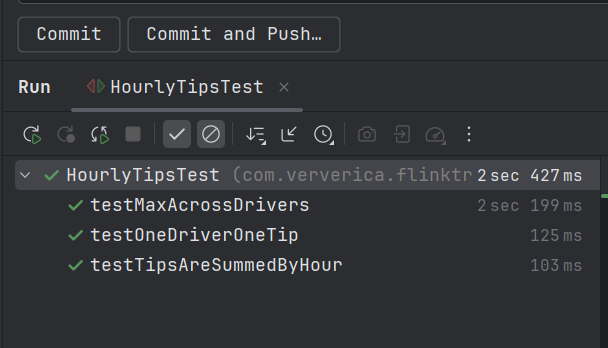
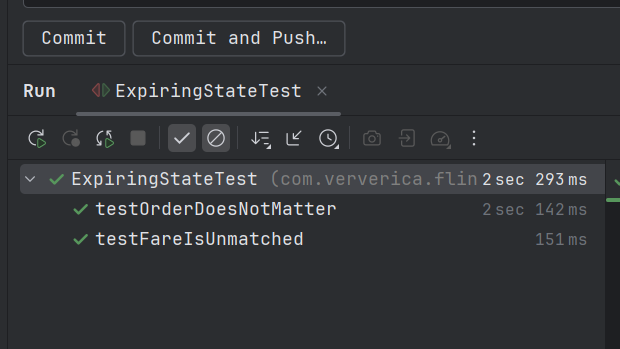

# Лабораторная 3. Потоковая обработка в Apache Flink

## Задание

Выполнить следующие задания из набора заданий репозитория https://github.com/ververica/flink-training-exercises:
  - RideCleanisingExercise
  - RidesAndFaresExercise
  - HourlyTipsExerxise
  - ExpiringStateExercise

## Результаты запуска тестов

### 1. Запуск RideCleansingTest

### 2. Запуск RidesAndFaresTest

### 3. Запуск HourlyTipsTest

### 4. Запуск ExpiringStateTest

